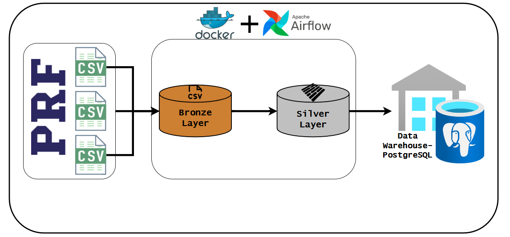

[](https://www.linkedin.com/in/raphael-cortes-b0b544305/)
[](https://www.instagram.com/raphaelcorte_s/)
[](https://wa.me/5561998294492)


# PRF Data Engineering Pipeline



Projeto de Engenharia de Dados end-to-end de sinistros de trânsito da PRF (Polícia Rodoviária Federal), com pipelines profissionais, processamento otimizado, carga em um Data Warehouse relacional focado em performance e orquestração automatizada em ambiente containerizado.

---

## 📊 Visão Geral

Este projeto implementa um **data engineering pipeline completo** para processar dados de sinistros rodoviários brasileiros (2007–2025), com foco em qualidade de dados, escalabilidade, modelagem dimensional (Star Schema) e orquestração via Apache Airflow.

**Dados Processados:**

- Histórico completo (mais de uma década de dados).
- Milhões de registros otimizados via carga na memória RAM.
- Variáveis originais transformadas, padronizadas e tipadas.

🔗 [Dados Abertos da PRF](https://www.gov.br/prf/pt-br/acesso-a-informacao/dados-abertos/dados-abertos-da-prf) (Agrupados por pessoa)

---
## 🏆 Destaques e Métricas de Processamento

A arquitetura foi desenhada para suportar alta volumetria e garantir integridade, lidando com desafios clássicos de bases governamentais legadas:

*   **Volumetria Massiva:** Carga final de **4.863.193** registros consolidados na tabela fato central do Data Warehouse.
*   **Performance Extrema:** Tempo de carregamento de quase duas décadas de histórico otimizado utilizando processamento em lotes e cache em memória RAM.
*   **Qualidade de Dados:** Taxa de rejeição de apenas **≈ 0,3%** (15.561 registros), com descarte de linhas corrompidas e geração automática de relatórios de auditoria em `.csv`.
*   **Otimização de Storage:** Remoção de variáveis redundantes (como feridos e mortos, facilmente obtidas via agregação SQL) para poupar espaço e processamento.
*   **Segurança de Domínio:** Uso de tipos `ENUM` nativos no PostgreSQL para blindar variáveis categóricas, impedindo a inserção de valores inválidos.
---

## 📚 Documentação Técnica Integrada

Para manter este arquivo conciso e focado na execução, as regras de negócio profundas e as decisões arquiteturais foram documentadas separadamente. Acesse:

- 📖 **[Dicionário de Dados e Regras de Negócio](./docs/dicionario_de_dados.md):** Origem das variáveis, tipos, domínios, equivalência de bases legadas e regras de descarte/limpeza.
- 🏗️ **[Arquitetura do Banco e Processo de Carga](./docs/arquitetura_banco.md):** Desenho do Star Schema, restrições UNIQUE, uso de ENUMs, idempotência (upsert) e observabilidade (geração de relatórios `.csv` para logs de rejeição).

---

## 🛠️ Stack Utilizada

| Componente | Ferramenta | Propósito |
|------------|------------|-----------|
| **Orquestração** | Apache Airflow | Agendamento e monitoramento da DAG |
| **Infraestrutura** | Docker Compose | Containerização de serviços (Isolamento total) |
| **Data Processing** | Python + Pandas | Processamento, manipulação e deduplicação |
| **Validação** | Pandera | Schema validation e garantia de qualidade |
| **Storage** | Parquet | Formato columnar otimizado para I/O |
| **Warehouse** | PostgreSQL 16 | Desempenho otimizado para consulta analítica |
| **Driver** | psycopg2 | Batch insert e persistência no banco |

---

## 📂 Estrutura do Repositório

```text
prf-sinistros-pipeline/
│
├── config/                              # Configurações de URLs para extração
├── dags/                                # DAG principal do Airflow (prf_pipeline_dag.py)
│
├── data/
│   ├── bronze/                          # Dados brutos (CSVs originais)
│   ├── silver/                          # Dados limpos + validados (Parquets)
│   └── logs/                            # Logs de linhas rejeitadas do DW (.csv)
│
├── docs/                                # Documentação técnica detalhada
│   ├── arquitetura_banco.md
│   ├── dicionario_de_dados.md
│   └── README.md
│
├── imgs/                                # Arquivos visuais do fluxo e modelagem
│
├── src/
│   ├── ingestion/                       # Download e extração de dados
│   ├── processing/                      # Limpeza + Validação unificadas (silver_process.py)
│   └── load/                            # ETL com Cache em RAM e Batch Insert
│
├── warehouse/                           # Infraestrutura do DW (Modelos lógicos/conceituais, DDL e Setup)
│
├── .env.example                         # Variáveis de ambiente (DB_HOST, senhas, chaves)
├── docker-compose.yaml                  # Infraestrutura multi-container (Postgres + Airflow)
├── Dockerfile                           # Imagem customizada do Airflow com dependências
└── requirements.txt                     # Dependências Python
```

## 📐 Modelagem do Data Warehouse

O Data Warehouse foi estruturado utilizando Modelagem Dimensional (Star Schema) no PostgreSQL, focado em alta performance OLAP para relatórios de sinistros de trânsito. O schema consolida as métricas na tabela fato central (fato_acidentes), cercada por 7 dimensões descritivas (Pessoa, Tempo, Local, Clima, Pista, Veículo, Classificação).

👉 Para detalhes sobre chaves, índices e tratamento de unicidade, consulte a [Documentação da Arquitetura do Banco](./docs/arquitetura_banco.md)

---

## 🚀 Como Usar (Ambiente Docker)

### 1. Pré-requisitos e Configuração

Docker Desktop (ou Docker Engine + Docker Compose) instalado.

Crie o arquivo de variáveis de ambiente:

```bash
cp .env.example .env
```

(Certifique-se de configurar suas senhas e variáveis no `.env` recém-criado).

### 2. Subindo a Infraestrutura

Com um único comando, levante todo o pipeline (Postgres, Airflow Webserver e Scheduler) em background:

```bash
docker compose up -d
```

### 3. Executando o Pipeline

Acesse o painel do Airflow em `http://localhost:8081` no seu navegador.

Faça login (Padrão: Usuário `admin`, Senha `admin` - ou conforme seu `.env`).

Habilite a DAG `prf_pipeline` (Unpause) e clique no botão **Trigger DAG (Play)**.

O processo (Download → Limpeza → Carga) ocorrerá de forma 100% automatizada.

### 4. Consultando os Dados

Conecte sua ferramenta favorita (DBeaver, pgAdmin ou extensão do VS Code) ao banco gerado:

- Host: `localhost` (ou `127.0.0.1`)
- Porta: `5432`
- Usuário / Senha / Banco: Consulte as chaves `DB_USER`, `DB_PASSWORD` e `DB_NAME` do seu `.env`.

### 5. Encerrando o Ambiente

Para desligar preservando os dados processados e os logs:

```bash
docker compose down
```

(Aviso: Adicionar a flag `-v` a este comando excluirá todos os volumes, deletando permanentemente o Data Warehouse e os arquivos processados).

---

### ▶ Execução Manual / Local (Sem Airflow)

Caso queira debugar ou executar os scripts individualmente sem a orquestração do Airflow, siga os passos abaixo. **Recomendamos fortemente o uso do Conda** para o gerenciamento do ambiente virtual (certifique-se de ter o Anaconda ou Miniconda previamente instalado na sua máquina).

**1. Setup do Ambiente Python:**

```bash
# Utilizando o Conda (Recomendado)
conda create -n prf-pipeline python=3.11
conda activate prf-pipeline

# OU utilizando o venv nativo do Python:
python -m venv venv && source venv/bin/activate

# Após ativar o ambiente escolhido, instale as dependências:
pip install -r requirements.txt
```

### 2. Execução Passo a Passo

```bash
python src/ingestion/download_prf_data.py
python src/processing/silver_process.py
python warehouse/setup.py
python src/load/load.py
```

(Nota: Para executar o DW localmente sem o container Postgres, você precisará de uma instância própria do PostgreSQL rodando na sua máquina e devidamente apontada no arquivo `.env`).

---

## 🛠️ Troubleshooting (Resolução de Problemas Comuns)

Esta seção documenta desafios de rede e infraestrutura encontrados durante a containerização e execução do pipeline.

### Sintoma
Erro de Conexão no Banco (`connection refused` / `could not translate host name`)

**Causa**
ncompatibilidade do parâmetro `DB_HOST` no arquivo `.env` dependendo de como você está executando o projeto.

**Solução**
- Se você for rodar os scripts localmente via terminal/Conda (fora do Docker), o host do banco precisa ser `localhost` ou `127.0.0.1` para que sua máquina encontre a porta exposta do Postgres.
- Se você for rodar via **Docker + Airflow**, os containers estão em uma rede interna própria. O Airflow não enxerga o banco como `localhost`, mas sim pelo nome exato do serviço do banco definido no `docker-compose.yaml`, que deve ser `postgres`. Portanto, altere a variável no seu `.env` para `DB_HOST=postgres` antes de subir os containers.

### Sintoma

O VS Code/DBeaver recusa a senha configurada ao tentar conectar na porta 5432.

**Causa**

Conflito com uma instalação local do PostgreSQL no Windows/Linux que já utiliza a porta 5432. A ferramenta de banco de dados conecta ao banco local, e não ao container Docker.

**Solução**

- Verifique se o Postgres local está rodando em background e pare o serviço.
- Alternativamente, altere o mapeamento de portas no `docker-compose.yaml` (ex: `"5433:5432"`) e conecte na nova porta externa. Certifique-se de usar a mesma senha definida no arquivo `.env`.

---

### Sintoma

Ao tentar abrir o pgAdmin local, o servidor Python falha ao subir.

**Causa**

O pgAdmin geralmente tenta alocar a porta fixa 5050. Se o Docker ou o Airflow estiverem rodando processos em segundo plano que esbarrem nessa porta de rede, o aplicativo travará.

**Solução**

Nas configurações do pgAdmin (ícone de engrenagem), desmarque a opção **"Fixed port number"**. O pgAdmin buscará dinamicamente uma porta ociosa e abrirá normalmente.
---

## 📜 Licença e Atualizações

MIT License | Última Atualização: Agosto de 2026

---

## 👨‍💻 Autor

Raphael Cortes Gomes - Cientista de Dados/Sanitarista

**LinkedIn:** linkedin.com/in/raphael-cortes-b0b544305

**Instagram:** @raphaelcorte_s

**WhatsApp:** Falar no WhatsApp