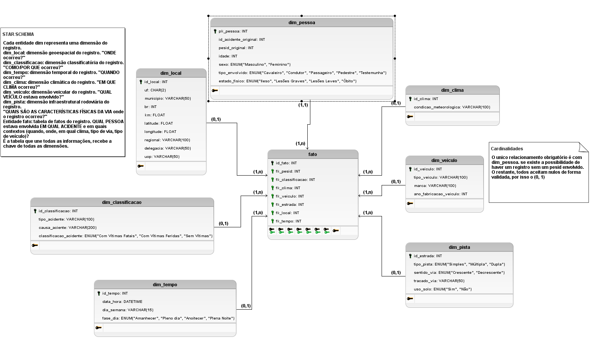

# Arquitetura do Banco de Dados e Processo de Carga (Gold Layer)

Este documento descreve a arquitetura do Data Warehouse (DW), as decisões de modelagem relacional e a estratégia de carregamento dos dados processados da Polícia Rodoviária Federal (PRF) para a camada **Gold**.

---

# 1. Modelagem do Banco de Dados (Schema Gold)

A camada **Gold** foi construída seguindo o modelo **Star Schema (Esquema Estrela)**, separando as entidades descritivas (**dimensões**) dos eventos de negócio (**tabela fato**). Essa arquitetura favorece consultas analíticas, reduz redundância e melhora o desempenho das operações de BI.


## 1.1 Tipagem Estrita e Domínios (ENUM)

Para garantir consistência entre os arquivos **Parquet (Silver)** e o banco de dados **PostgreSQL**, todos os campos textuais com domínio conhecido foram convertidos em **tipos ENUM nativos**.

### Benefícios

- impede inserção de valores inválidos;
- garante integridade dos domínios;
- reduz espaço de armazenamento;
- melhora a performance de comparação de valores.

### Exemplos de ENUMs

- `condicao_dia_enum`
- `tipo_pista_enum`
- `sentido_via_enum`
- `sexo_enum`
- `estado_fisico_enum`

---

## 1.2 Regras de Unicidade e Chaves

Foram definidas restrições **UNIQUE** para impedir duplicações decorrentes de reprocessamentos ou da união de bases históricas.

### Tabela `dim_pessoa`

```sql
UNIQUE (id_acidente_original, pesid_original)
```

Garante que uma mesma pessoa envolvida em um mesmo acidente seja registrada apenas uma vez.

---

### Tabela `dim_veiculo`

```sql
UNIQUE (id_acidente_original, id_veiculo_original)
```

Impede duplicidade de veículos associados ao mesmo acidente.

---

### Tabela `fato`

```sql
UNIQUE NULLS NOT DISTINCT
(fk_pesid, fk_tempo, fk_local)
```

Essa restrição garante que um mesmo evento (uma pessoa, em um local específico e em um determinado momento) não seja inserido mais de uma vez.

---

# 2. Estratégia de Carregamento (`load.py`)

O processo de carga foi desenvolvido priorizando dois objetivos principais:

- **alto desempenho (performance);**
- **idempotência**, permitindo que o script seja executado diversas vezes sem gerar duplicidades.

## Inserção em lotes (Batch Processing)

As inserções utilizam:

```python
psycopg2.extras.execute_batch()
```

com

```python
page_size = 5000
```

Essa estratégia reduz significativamente o número de viagens entre aplicação e banco de dados, aumentando a velocidade de carga.

---

## Tratamento de conflitos (Upsert)

Todas as inserções utilizam:

```sql
ON CONFLICT (...) DO NOTHING
```

em conjunto com as restrições **UNIQUE** do banco.

Quando um registro já existe, o PostgreSQL simplesmente ignora a tentativa de inserção, permitindo cargas incrementais seguras.

---

## Cache em memória (RAM)

Durante a carga da **Tabela Fato**, todas as chaves primárias das tabelas dimensão são carregadas previamente em dicionários Python.

Isso evita consultas ao banco para cada registro.

Em vez de executar milhões de consultas SQL, o processo realiza buscas instantâneas em memória (`O(1)`), reduzindo drasticamente o tempo total de carregamento.

---

# 3. Observabilidade e Auditoria de Rejeições

A camada Gold exige integridade referencial completa.

Caso uma linha da tabela fato não consiga localizar alguma chave estrangeira obrigatória, ela não é inserida.

## Regras de descarte

Um registro é rejeitado quando não é possível encontrar uma das seguintes chaves:

- `fk_pesid`
- `fk_tempo`
- `fk_local`

Esses registros são descartados apenas da tabela fato.

---

## Logs de auditoria

Os registros rejeitados **não são descartados silenciosamente**.

O pipeline registra o motivo da rejeição e exporta relatórios em formato **CSV**, separados por ano.

Exemplo:

```text
data/logs/
├── rejeitados_2007.csv
├── rejeitados_2008.csv
├── ...
└── rejeitados_2025.csv
```

Cada relatório contém informações suficientes para rastrear a causa da rejeição e permitir análises posteriores.

---

# 4. Métricas do Processamento

A carga completa do histórico da PRF (2007–2025) apresentou baixa taxa de rejeição graças aos tratamentos realizados nas camadas **Bronze** e **Silver**.

## Estatísticas gerais

| Métrica | Valor |
|---------|-------:|
| Registros inseridos na tabela fato | **4.863.193** |
| Tempo total de carregamento | **≈ 43,3 minutos** |
| Tempo em segundos | **2.599,78 s** |
| Registros rejeitados | **15.561** |
| Taxa de rejeição | **≈ 0,3%** |

NOTA: O tempo total de carregamento depende da capacidade de processamento do computador que está executando o pipeline. Para título de comparação, o computador do autor do projeto possui um pocessador FX-6300 e 8GB RAM DDR3. Esse tempo pode ser drasticamente diminuído em máquinas mais modernas, ou até mesmo em ambiente com processamento distribuído, como em serviços nuvem ou ambiente empresarial.

---

## Registros rejeitados por ano

| Ano | Registros rejeitados |
|----:|---------------------:|
| 2007 | 410 |
| 2008 | 675 |
| 2009 | 1.468 |
| 2010 | 1.515 |
| 2011 | 1.329 |
| 2012 | 1.055 |
| 2013 | 658 |
| 2014 | 788 |
| 2015 | 669 |
| 2016 | 488 |
| 2017 | 661 |
| 2018 | 510 |
| 2019 | 460 |
| 2020 | 675 |
| 2021 | 741 |
| 2022 | 832 |
| 2023 | 788 |
| 2024 | 948 |
| 2025 | 891 |
| **Total** | **15.561** |

---

# Considerações Finais

A arquitetura da camada **Gold** foi projetada para garantir:

- integridade referencial;
- consistência dos dados;
- desempenho em consultas analíticas;
- idempotência no processo de carga;
- rastreabilidade de registros rejeitados;
- facilidade de manutenção e expansão do Data Warehouse.

A combinação de validações nas camadas **Bronze**, **Silver** e **Gold**, aliada ao uso de **restrições relacionais**, **ENUMs**, **processamento em lotes** e **cache em memória**, resulta em um pipeline robusto e preparado para cargas históricas e incrementais em larga escala.